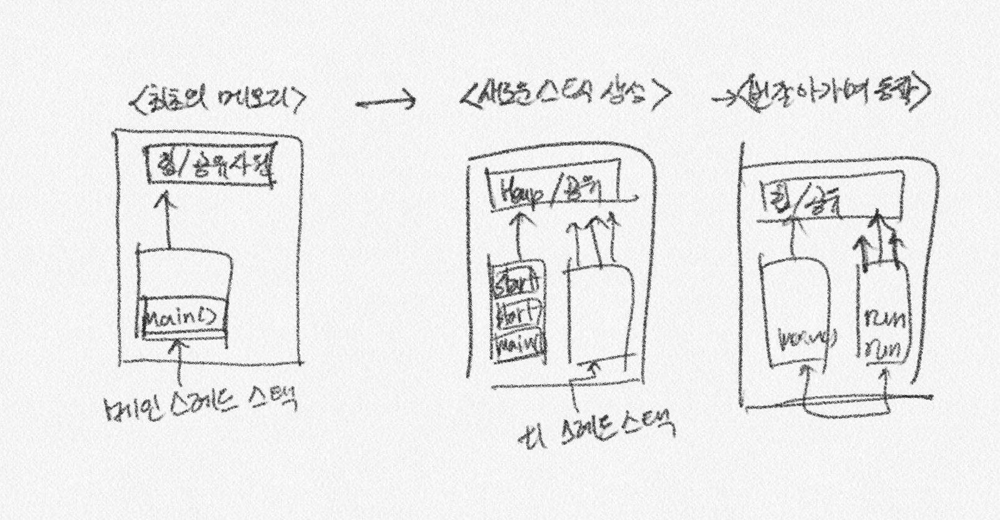
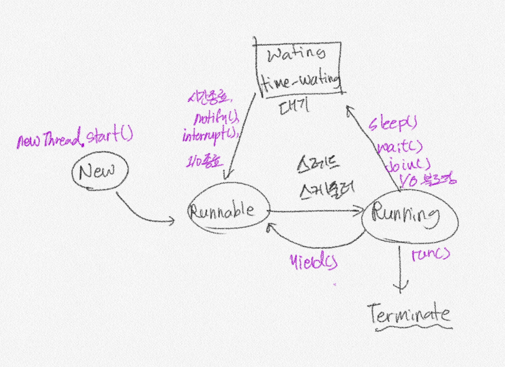

# Thread

- 동시성

  > Concurrency

  - Logical
  - Single Core, Multi Core

  > Parralel

  - Physical
  - Multi Core

  **Java Virtual Machine**

  > 결국 java code는 JVM위에서 실행되므로 JVM의 동시성을 이해하면 물리적/기계적으로 동시성을 이해할 필요가 없다.


## Java Thread 의 이해

- 프로세스 : 개별적으로 동작하는 프로그램(이클립스, 메신져 등)
- 스레드 : 프로세스를 구성하는 작은 실행 단위 (메신져 = 채팅 + 파일 전송)
- 멀티프로세스 : 동시에 여러개의 프로세스를 실행하는 것
- 멀티스레드 : 하나의 프로세스에서 여러개의 스레드가 동시에 동작하는 것


## Java Thread의 생성

1. Runnable Interface 활용

2. Thread  직접 상속

   

- Runnable interface

  package : virus

  ```java
  public class CoronaRunnable implements Runnable{
      int num;
      
      public CoronaRunnable(int num){
          this.num =num;
      }
      
      @Override
      public void run(){
          for( int i=0; i < 1000 ; i++){
              int j = i *100;
          }
          sysout(num)
      }      
  }
  ```

- 생성 및 실행 (main())

  ```java
  import virus.CoronaRunnnable;
  
  public class CoronaThreadTest{
      public static void main(String[] args){
          for(int i=0; i<10000; i++){
              CoronaRunnable cr = new CoronaRunnable(i);
              Thread t = new Thread(cr);
              t.start();
          }
      }   
  }
  ```


- Thread 직접 상속 & 실행

  ```java
  public class CoronaThread extends Thread{
      int num;
      // constructor
      // Override  
  }
  ```

  ```java
  import virus.CoronaThread;
  
  public class CoronaThreadTest{
      // main()
      for(int i=0; i<1000; i++){
      	CoronaThread ct = new CoronaThread(i);
          ct.start
      }
  }
  ```

  

## Thread의 실행

JVM에서 `main()` 스레드 실행 ->`main()`에서  `t1.start()` ,`t2.start()`...-> JVM에서 실행 가능할떄 실행

JVM에서 `t1`,`t2`,`t3`... 실행시킴 (우선순위에 따라서)

> main() 또한 Thread라는걸 인지하고 있어야 함.




## Java Thread 대기

- Thread.sleep(`mili time`)

  ```java
  //Thread 혹은 Runnable class
  @Override
  public void run(){
  	for(){
          try{
              Thread.sleep(500); //0.5초씩 대기
          }catch(){
              
          }
      }	
  }
  ```

  > 다른 쓰레드가 끝나기 전에 메인쓰레드가 먼저 종료될 수 도 있다.

- join();

  > 특정 스레드가 끝나기 전까지 대기.

  ```java
  //main
  CoronaRunnable cr = new CoronalRunnable(2020);
  Thread t= new Thread(cr)
  t.start();
  
  try{
      t.join()
  }catch(){
      
  }
  ```

## Java Thread  상태





## Java Thread 간섭

- interrupt() w/ main thread  

  TroubleShooting w/ `InterruptedException`

  > 간섭을 걸면 대기상태에 있던 Thread들을 강제로 Runnable로 옮김.
  >
  > interrupt에 걸렸을때 대비하려면 catch block에서 처리.

  ```java
  //Thread class
  try(){
      // 정상 스레드 실행.
  }catch(InterruptedException){
      // 간섭 받았을때
  }
  ```

  ```java
  //main
  t.start()
  t.interrupt();
  ```

- yield()

  > Running상태에서 실행양보하지만, 대기 풀로 가지않고 Runnable로 이동해서 우선순위 경쟁.

- *Thread.stop()* 

  > 예기치 못한 문제들이 많으므로 사용 금지!

## Java Thread 동기화

- lock by synchronized

  > 공유 데이터의 lock 확보한 후 다른 쓰레드의 접근을 제한하고 배타적인 사용
  >
  > 선점하는 동안 자원에 접근을 막는다.

- synchronized keyword

  - by method 
  - by block in method : better (블럭단위)

  공유자원 `balance`에 대한  lock을 걸고 차례대로 이용

  ```java
  // class Thread
      //run()
          synchronized(account){
              if (account.balance > 0){ 
                  try{
                      Thread.sleep(500)
                  }catch(exception){
                  }
                  account.balance -= 100;
              } 
          }
  ```

  ```java
  //main()
  Balance bc = new Balance();
  
  for(i -> 1000){
  	ThreadSync t = new ThreadSync(balance); //synchronized
  	t.start(); 
  }
  ```


## Java Thread 동기화 2

- wait() : notify me later when ready
  - notify() : did sth wake up one wait thread
  - notifyAll() : did sth wake up all wake up all wait thread
- wait Thread와 notify thread는 상호 보완적

- DeakLock  :서로 다른 스레드가 각각 락을 걸여서 다른 Thread가 가진 자원을 wait하는 경우.

```java
// class Threadnotify
    //run()
        synchronized(account){
            account.power = account.power + 100;
            account.notifyAll();
        }
```

```java
// class Threadsych
	//run()
		synchronized(account)
            //잔고가 적으면 wait로 들어감
            if account.balance < 100
                try
                    account.wait();
                catch       
            // notify 받으면 다시 실행. 
            if account.balance >= 100
                try
                    Thread.sleep(500);
                catch
                	//exception
                account.balance = account.balance - 100;
                    
                    
```


